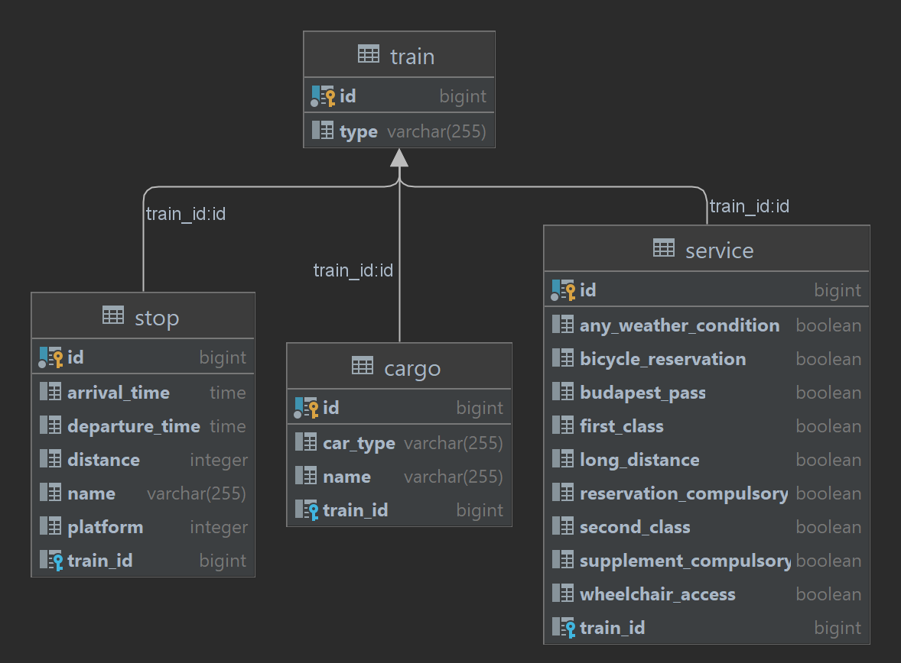

# train-schedule-api

Ennek a REST API-nak a célja vonatok és vonat menetrendek kilistázása a felhasználó számára.

A program hátterében egy PostgreSQL adatbázis fut, mely négy táblával rendelkezik:  
- Train (a fő tábla, mely kapcsolódik a többi táblához és tartalmazza a vonat típusát)  
- Stop (N:1 kapcsolat a Train-nel, állomás név, érkezés/távozás ideje, indulás óta megtett táv, platform szám)  
- Service (1:1 kapcsolat a Train-nel, személyvonatokhoz tartozó adatok, például első/másodosztály, helyjegyköteles, stb)  
- Cargo (N:1 kapcsolat a Train-nel, tehervonatokhoz tartozó szerelvények típusai és a rakományok nevei)  

## DatabaseBuilder:  
Első indításkor vagy újra inicializáláskor szükséges az adatbázis alaphelyzetbe állítása. Ehhez futtassuk le a   
DatabaseBuilder alkalmazást, mely a FlyWay migrációs eszköz segítségével törli, majd létrehozza  
az adattáblákat, és feltölti őket alapértékekkel. Ezután az alkalmazás a meglévő adatok alapján generál még  
párat, hogy nagyobb legyen az adatbázis.

## TrainScheduleApiApplication:  
Az alkalmazás elindításakor feláll a Spring Boot környezet és kapcsolódik az adatbázishoz.  
Ezekután böngésző vagy API kliens segítségével (pl Postman) lekérdezéseket küldhetünk az API-nak.  
A lekérdezések eredménye logolásra kerül a terminálon, illetve hiba esetén a hiba típusa és hibaüzenet.  
Az endpointok megtekinthetők a Swagger UI elindításával. (http://localhost:8080/swagger-ui.html)

## Fő endpointok:  
### GET: /schedule/passenger/{departure_location}/{arrival_location}  
az induló és érkező településnet megadva visszakapunk egy menetrend listát  
azokról a személyvonatokról melyek áthaladnak ezeken a településeken, indulási idejük szerint sorrenbe rakva.  
Kikalkulálódik emellett a megteendő út hossza és az utazás ideje.  
### GET: /schedule/freight/{departure_location}/{arrival_location}  
ugyanez a lekérdezés tehervonatokkal  
### GET: /train/freight/{cargo_name}  
a rakomány nevét megadva kilistázásra kerül az összes tehervonat mely szállít  
ilyen rakományt.